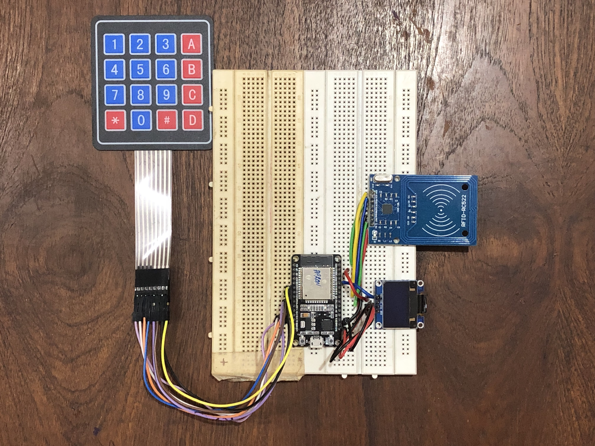

# Smart Trolley
 At large shopping centers and malls customers are often seen waiting in endless queues to get their purchase billed. This project aims at finding a solution to ths annoying situation and eleminate the need for billing counters.

This is achieved by having a system integrated into the trolleys itself, that can detect if an item has been dropped into the cart and have it added to the virtual cart. This way the bill is immediately and automatically generated on the go. After they are done shopping the customers can view the bill on the website and pay for their purchase through their preferred mode of payment. The bills generated can be accessed by the customer anytime by just logging in to their account.

# Here's how the system is implemented

The traditional billing systems basically have two parts:
1. A device for scanning a unique ID given to each product(Often a barcode reader)
2. A software that generates the bill

The smart trolley swaps the barcode readers for RFID readers and barcode stickers for RFID tags and in place of the software a website is used.

The circut consists of an esp32 which serves as the brain of the RFID reader system. The system has in it an RFID reader module to read the RFID tags, a keypad for user authentication, an OLED display for user interaction as in the image below:

# Different parts of the website

1. New customer Registration

When a customer uses the system for the first time he/she is required to create an account in which all the bills and transactions are saved. The customers are asked for their phone number as their unique identification number and a set a security pin.

2. Customer Login Page

This page prompts the user for their mobile number and the pin they set up when registering. On successful authentication the user is taken to the dashboard.

3. Customer Dashboard

This is the main landing page for the customers. Here they can access their current/ongoing shoping cart and previous shopping details.

4. Billing Page/Shopping Cart

This is the page that displays the realtime list of the products purchased by the customer. The page aslo will have a checkout button to download the invoice and navigate to a payment gateway if opted by the customer. As of now for deleting a product from the cart the cart manually as the system is incapable of detecting is a product was added or removed from the trolley.

5. Store management Page

This page is for the store to add modify or delete products in the inventory. The store can access it by logging in to the store mannagement page. 

